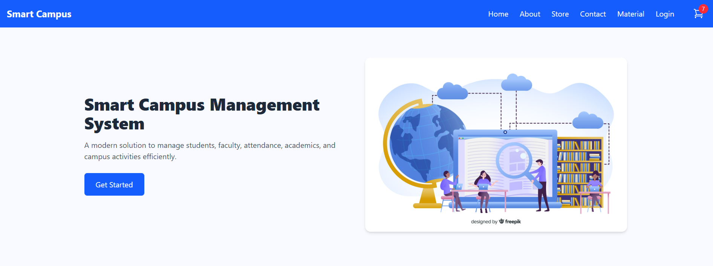
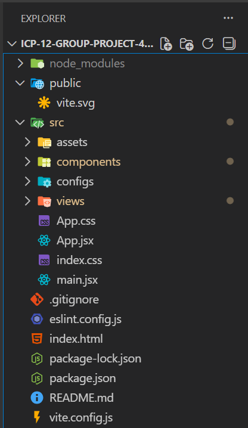

# 🚀 Smart Campus – College Management & Student Resource Platform  

## 👉 Live Website  
🌐 [https://your-smartcampus-link.netlify.app/](https://your-smartcampus-link.netlify.app/)  

---

## 📌 About the Project  

**Smart Campus** is a modern **React-based college management and student resource platform** designed to simplify academic life for students.  
It provides access to **previous year question papers, a stationery store, attendance tracking, and essential college information** — all in one platform.

---

## 🏠 Homepage  

---

## ✨ Features  

### 📘 Previous Year Question Papers  
- 📂 Browse and download subject-wise question papers  
- 🔍 Filter by department, semester, subject, and year  
- 📑 Organized and easy-to-access question bank  

### 🛍️ Stationery Store  
- 🧾 Browse essential stationery products  
- 🛒 Add items to cart  
- 💳 Checkout using the “Pay Now” feature  

### 👩‍🎓 Student Login & Attendance  
- 🔐 Secure student login system  
- 📅 View attendance records  
- 📊 Track academic presence easily  

### ℹ️ About & Contact  
- 🏫 College information (mission & vision)  
- 📞 Contact form for student queries  

---

## 🛠️ Tech Stack  

**Frontend:**  
- HTML
- Tailwind CSS 
- JavaScript   
- React.js     

**Tools & Platforms:**  
- Git & GitHub  
- Netlify (Deployment)  

---

## 📂 Project Structure  

---

## ⚙️ How to Run This Website  

### ▶️ Run Locally
1️⃣ **Clone or download the repository:**  
👉 [Smart Campus GitHub Repository](https://github.com/pratiksha950/ICP-12-Group-Project-4-React-SmartCampus)

---
---

## 👩‍💻 Contributors  

Made with [contrib.rocks](https://contrib.rocks).
---
Status:

