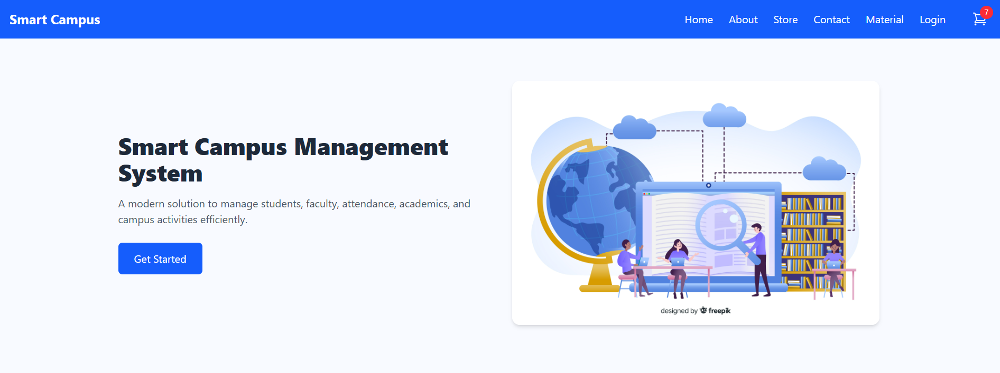
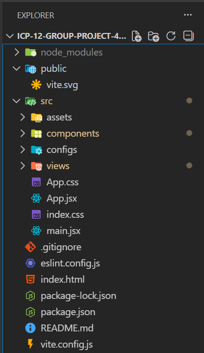

# 🚀 Smart Campus – College Management & Student Resource Platform

## 👉 Live Website

🌐 https://smart-campus-0rqf.onrender.com

## 👉 Backend API

🔗[ https://your-backend-link.onrender.com](https://smart-campus-prec.onrender.com)

---

## 📌 About the Project

**Smart Campus** is a modern **React-based college management and student resource platform** designed to simplify academic life for students.
It provides access to **previous year question papers, a stationery store, attendance tracking, and essential college information** — all in one platform.

---

## 🏠 Homepage

---

## ✨ Features

### 📘 Previous Year Question Papers

* 📂 Browse and download subject-wise question papers
* 🔍 Filter by department, semester, subject, and year
* 📑 Organized and easy-to-access question bank

### 🛍️ Stationery Store

* 🧾 Browse essential stationery products
* 🛒 Add items to cart
* 💳 Checkout using the “Pay Now” feature

### 👩‍🎓 Student Login & Attendance

* 🔐 Secure student login system
* 📅 View attendance records
* 📊 Track academic presence easily

### ℹ️ About & Contact

* 🏫 College information (mission & vision)
* 📞 Contact form for student queries

---

## 🛠️ Tech Stack

**Frontend:**

* HTML
* Tailwind CSS
* JavaScript
* React.js

**Backend:**

* Node.js
* Express.js
* MongoDB

**Tools & Platforms:**

* Git & GitHub
* Netlify (Frontend Deployment)
* Render (Backend Deployment)

---

## 📂 Project Structure

---

## ⚙️ How to Run This Website

### ▶️ Run Locally

1️⃣ Clone the repository
👉 https://github.com/pratiksha950/Smart-Campus

2️⃣ Install dependencies
npm install

3️⃣ Run frontend
npm run dev

4️⃣ Run backend
cd server
npm start
